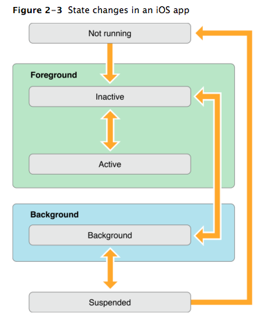
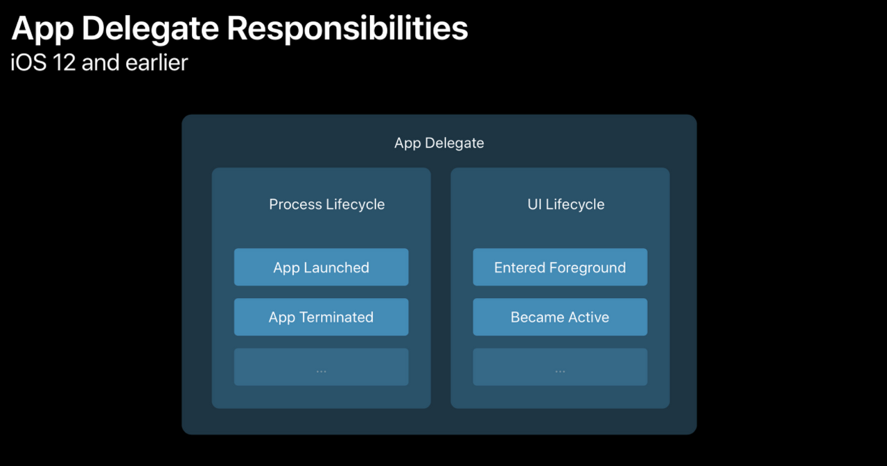
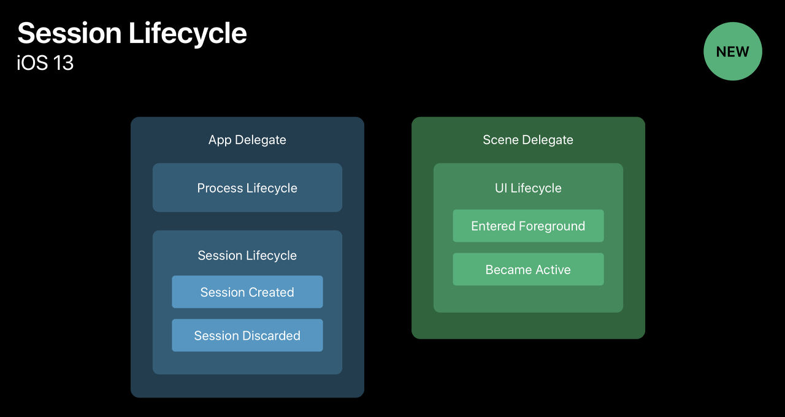

# iOS 앱 기초

## iOS 앱 동작의 이해

- 앱이 시작되면 
- 앱 자체의 정보를 가지는 UIApplication 객체가 생성된다.
- UIApplication 객체는 두가지 작업을 한다.
    - info.plist에서 정보를 불러와서 앱을 세팅하고, 이벤트 루프를 만드는 등 앱을 시작한 준비를 하는 동시에
    - 개발자가 앱 라이프사이클에 접근할 수 있도록 도와주는 AppDelegate 객체를 만들어준다.
- 이런 준비가 끝나고 AppDelegate가 `application(_:didFinishLaunchingWithOptions:)`를 호출하며 앱이 시작된다.

ios 앱의 런타임은 이런 모습이다. 유저의 이벤트가 메인루프에서 핸들링 되고 Application Object, Core objects를 통해 유저에게 응답한다.

위는 ios 앱의 상태 사이클이다.

- Not running: 앱이 시작되지 않은 상태이다.
- Inactive: 포그라운드로 넘어가는 과정이다.
- Active: 포그라운드로 넘어가 유저가 사용중인 과정이다.
- Background:  백그라운드로 넘어간 상태이다. 이때 다시 사용하게 되면 Inactive로 돌아가고, 시간이 오래 지나면 OS가 Suspend 시킨다.
- Suspended: 오래 접근되지 않아서 중단된 상태이다.

이는 앱의 프로세스 라이프사이클이고, 앱의 UI 구성 요소를 보면 다음과 같다.

- UIScreen : 기기에 연결되는 물리적인 화면을 정의하는 객체
- UIWindow : 화면 그리기 지원 도구를 제공하는 객체
- UIView : 그리기를 수행할 객체 세트

UIWindow 에서 viewControllwer를 통해 View 객체를 업데이트 하면서 화면은 렌더된다.

근데 이게 ios 13이 나오면서 크게 바뀐다. 한 앱마다 화면 하나만 띄울 수 있는 환경에서 여러 화면을 띄울 수 있게 바뀌면서 window => scene으로 단위가 바뀌고 라이프사이클 핸들링도 변경되었다.

이전까지는 AppDelegate에서 프로세스 라이프사이클과 UI라이프사이클을 같이 관리했는데, 이게 분리되었다.

AppDelegate는 이제 프로세스 라이프사이클과 세션 라이프사이클을 책임지고, SceneDelegate에서 UI 라이프사이클을 책임진다.

이게 또 SwiftUI에서 크게 바뀐 것 같다.

AppDelegate와 SceneDelegate가 없어지고 WindowGroup.onChage라는 메소드로 라이프사이클의 변화를 감지할 수 있는 듯하다.

---
## REF
- https://chocozero.github.io/IT/iOS/2018-02-05/iOS-Xcode%EB%A1%9C-UI%EB%8B%A4%EB%A3%A8%EA%B8%B0-%EA%B8%B0%EC%B4%88/
- https://hcn1519.github.io/articles/2017-09/ios_app_lifeCycle
- https://duwjdtn11.tistory.com/495
- https://hcn1519.github.io/articles/2017-09/ios_app_lifeCycle
