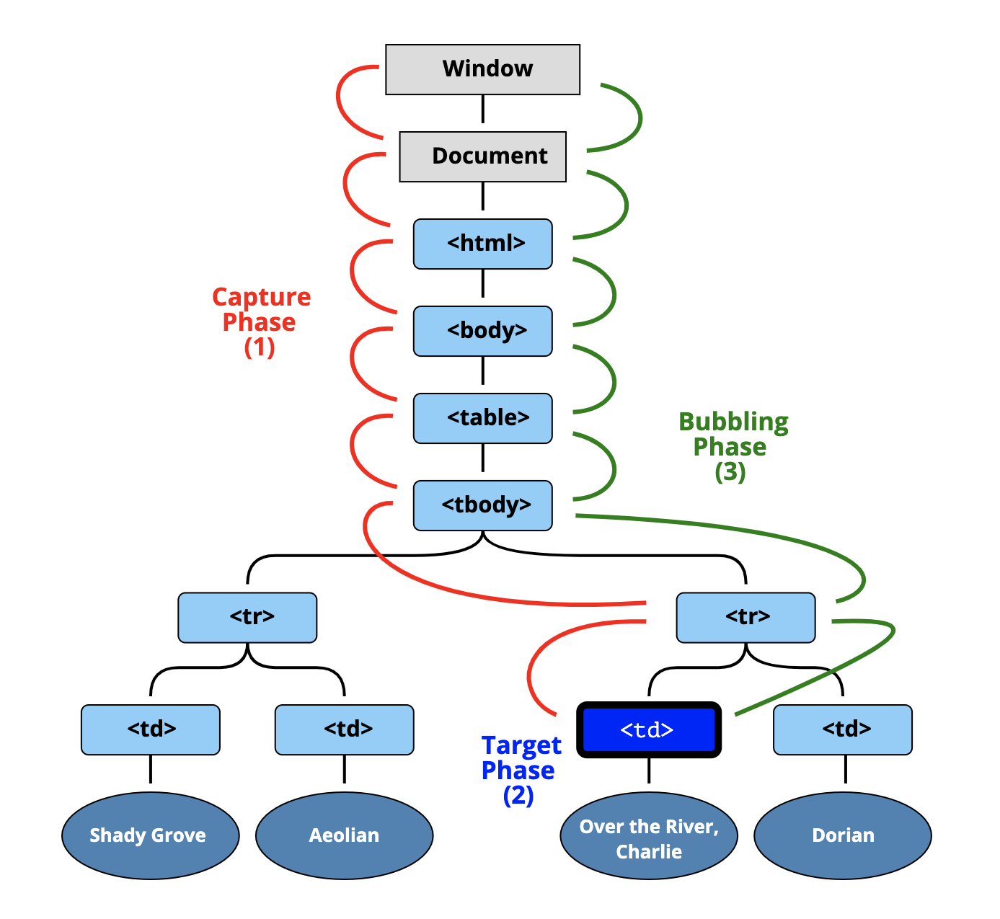

자바스크립트의 이벤트 프로퍼게이션에 대해 알아보자.

## 이벤트 버블링

버블 정렬에서의 버블을 생각하면 된다. 자바스크립트의 거의 모든 이벤트는 버블링되는데, 상위 요소로 한 단계 한 단계 전달된다는 뜻이다.

```html
<body>
	<div class="one">
		<div class="two">
			<div class="three">
			</div>
		</div>
	</div>
</body>
```

이런 형태의 `html` 문서에서 세번째 `div-#three`에 이벤트가 발생하면 해당 이벤트는 `div-#three` => `div-#two` => `div-#one` => `body` 로 전달된다.


만약 이때 이벤트가 버블링되는 것을 막고싶다면, 다음과 같이 이벤트 객체의 `stopPropgation` 메소드를 호출하면 된다. 
```js
function eventHandlerFunction(evnet) {
	event.stopPropagation()
	// ... handling tasks
}
```
## 이벤트 캡쳐링

이벤트 캡쳐링은 이와는 반대로 상위에서 부터 찾아내려가는 방식이다. 이에 대해 설명하기 전에 우선 자바스크립트에서 이벤트에 대한 처리가 일어나는 방식을 알아보자.



1. 전역객체(최상위)에서 이벤트가 발생한다.
1. 타겟 엘리먼트까지 하위로 하나 하나 타고 이벤트가 내려간다. - (1) 캡쳐 페이즈
1. 타겟 엘리먼트에서 이벤트가 트리거 된다. - (2) 타겟 페이즈
1. 최상위 까지 다시 하나 하나 타고 올라간다. - (3) 버블링 페이즈

이때 다음 처럼 
```js
elem.addEventListener(..., {capture: true})
```

코드에 명시한다면 (1)번 캡쳐 페이즈에서 하위 단계로 탐색해 나가는 과정에서 이벤트 리스너를 실행시킬 수 있다.

## 이벤트 위임

거의 모든 이벤트가 버블링 된다는 것을 이용한 이벤트 핸들링 패턴. 최상위 개체(`document`나 `window`로 사용하는 듯)에 어떤 이벤트에 대한 핸들링을 모두 관리하는 형태이다. 

어떤 개체에 대해 이벤트가 발생하든 모두 핸들링 할 수 있도록 최상위에 핸들러를 달고, 실제로 이밴트가 발생한 타겟을 `event.target`으로 구분해서 각각 적절한 동작을 구현한다.